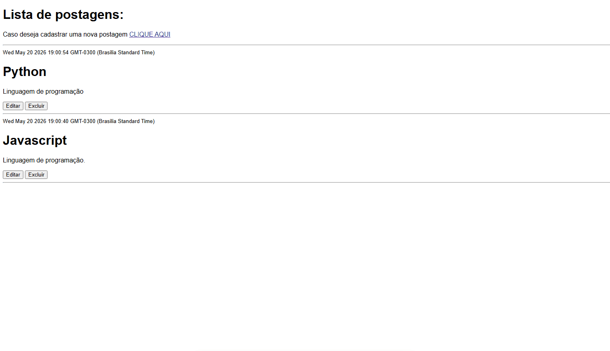

# Sistema de Tarefas

Sistema CRUD de tarefas desenvolvido com Node.js, Express, Sequelize, MySQL e Handlebars.

## Requisitos

- [Node.js](https://nodejs.org/) **20.x ou superior** (abaixo da 23)
- [MySQL](https://www.mysql.com/) em execução
- npm (incluído com o Node)

## Funcionalidades

- Criar tarefas
- Editar tarefas
- Excluir tarefas
- Listar tarefas
- Datas automáticas
- Integração com MySQL

## Rotas

| Método | Rota | Descrição |
|---------|-------|------------|
| GET | `/` | Lista todas as tarefas |
| GET | `/cadastro` | Exibe o formulário para criar uma nova tarefa |
| POST | `/add` | Cria uma nova tarefa |
| GET | `/editar/:id` | Exibe o formulário de edição da tarefa |
| POST | `/editar/:id` | Salva as alterações da tarefa |
| POST | `/deletar/:id` | Remove uma tarefa |


## Tecnologias

- Node.js
- Express
- Sequelize
- MySQL
- Handlebars
- Dotenv

## Como executar

1. Clone o repositório e instale as dependências:

```bash
npm install
```

2. Copie o arquivo de exemplo e preencha com seus dados locais:

```bash
cp .env.example .env
```

3. Crie o banco no MySQL (ex: postapp) e garanta que a tabela exista (o Sequelize cria na primeira execução, se necessário).

4. Inicie o servidor:

```bash
npm run dev
```

Ou em modo produção:

```bash
npm start
```

5. Acesse: http://localhost:3001

## Sistema funcionando


